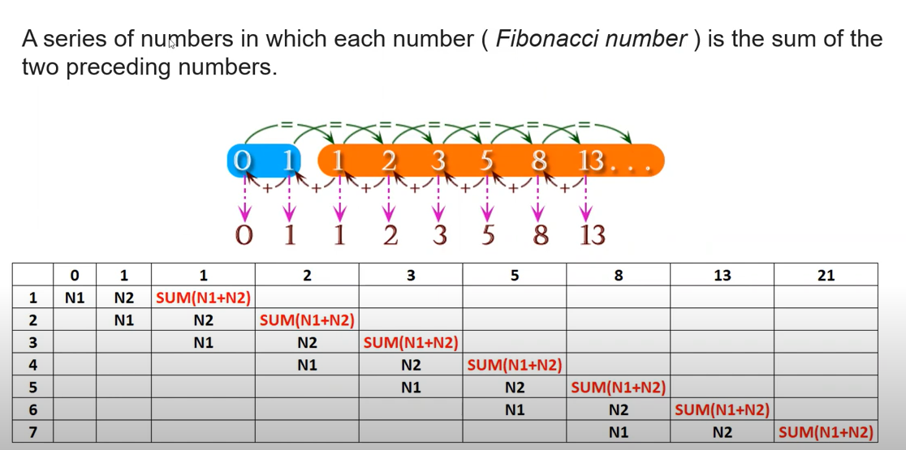
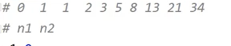
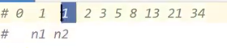

# What is fibonacci series:

# The Logic:

# Fibonacci Series Generator

This is a simple Python program to display the Fibonacci series. The Fibonacci series is a sequence of numbers in which each number is the sum of the two preceding ones, usually starting with 0 and 1. This program prints the first 10 numbers in the Fibonacci series.

## Getting Started

These instructions will help you run the Fibonacci series generator on your local machine.

### Prerequisites

You need to have Python installed on your computer. You can download and install Python from [python.org](https://www.python.org/downloads/).

### Running the Program

1. Clone the repository to your local machine:

   git clone https://github.com/MrBytes10/Fibonacci-Series-Generator.git
   cd Fibonacci-Series-Generator

2. Open the `printFibonacciSeries.py` file:
   python printFibonacciSeries.py

3. Run the script:

   python printFibonacciSeries.py

4. The program will output the first 10 numbers of the Fibonacci series.

## How It Works

The script works by starting with two initial numbers, 0 and 1. It then iterates through a loop, calculating the next number in the series as the sum of the two previous numbers. The new number is printed and the previous two numbers are updated to the next numbers in the series.

## Contributing

Feel free to submit issues or fork the repository and send pull requests. Contributions are welcome!

## Acknowledgments

- This code is a basic implementation for educational purposes and to get started with generating the Fibonacci series in Python.
